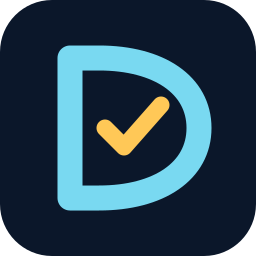

# pytest-obligation



[](https://github.com/gigaverse-app/pytest-obligation/actions/workflows/ci.yml)
[](https://pypi.org/project/pytest-obligation/)
[](https://pypi.org/project/pytest-obligation/)
[](https://github.com/gigaverse-app/pytest-obligation/blob/main/docs/pytest-plugin.md)
[](https://typing.python.org/en/latest/spec/distributing.html)
[](LICENSE)

## Don’t lose orders, money, receipts, or work when the happy path breaks

Your app may commit an order, charge a customer, schedule a task, send a
receipt, publish to Kafka, or call Shopify. A worker can die one line later; a
broker reply can be lost; a retry can run the external effect twice. Ordinary
tests usually exercise only the path where none of that happens.

**pytest-obligation generates tests for work your application cannot afford to
lose or repeat.** Bind an `ObligationContract` to your real workflow and recovery
path, yourself or with a coding agent. The harness generates standardized tests
for crashes, retries, lost messages, and competing operations, exposing failure
cases you might never think to write by hand. Its fault injection interrupts
commits, workers, messages, and external calls, then checks whether recovery
reaches the right outcome without lost work or duplicate effects.
The agent can use the same fault-injection infrastructure to add focused tests
for your application's particular risks. The core accepts plain Python
callables: it assumes no framework, database, queue, or business domain.

It integrates as a pytest plugin in your existing test suite and CI. Read the
[pytest plugin guide](https://github.com/gigaverse-app/pytest-obligation/blob/main/docs/pytest-plugin.md)
for automatic discovery, test selection, reports, and configuration.

Coming from distributed systems and familiar with Jepsen? pytest-obligation
brings a similar approach to your application's workflows. Read
[Jepsen-style fault testing for application work](docs/jepsen-analogy.md).

## What it finds

- **Lost work:** a Django transaction commits an order, but a Celery task or
  Kafka message is never published; a dead worker's task is never picked up.
- **Duplicate effects:** a retry sends two receipts, charges twice, or repeats
  an external API call after the first result became uncertain.
- **Wrong final state:** a stale worker overwrites a newer result, a checkout
  takes a payment without creating an order, or cleanup deletes work still owed.

These are not just hypothetical failures. [Runs against Saleor, Wagtail,
procrastinate, DBOS, RQ, and Celery](demos/README.md) show the real code,
failure timing, observed result, and—in several cases—a fix that makes the
same proof pass. For example, a Saleor Payments API checkout can capture a
payment and lose the order when the worker dies between those steps; a DBOS
notification step can send twice when it is replayed.

## What a finding looks like

One crash history compares the normal outcome with the outcome after a
specific interruption:

```text
pytest_obligation.HistoriesDiverged: orders: handoff 'place order': normal operation reaches
('SENT', 1), but these histories reach something else: {'worker died after external call 1':
('SENT', 2)}. Work was lost or repeated. ...
```

The second send is visible instead of being hidden behind a green happy-path
test. Known, independently reproduced gaps remain **strict xfails**; a change
that fixes one turns it red so the finding must be re-evaluated. See
[how crash histories work](docs/how-it-works.md#crash-histories) and
[what a green result means](docs/what-a-green-result-means.md).

## Stronger tests without hand-writing more tests

Declare the workflow once in an `ObligationContract` and expose it through
`@due_work_contract_suite(CONTRACT)`. At pytest collection time, the harness
generates cases for the applicable A–J guarantees: recovery, ownership, crash
ambiguity, retention, convergence, derived obligations, gated execution,
harmless replay, indivisible admission, and retry limits. As the harness gains
checks for a profile you already bound, upgrading can generate more cases from
the same contract. New profiles or bindings still need your assessment. The
separate handoff scan spots newly introduced queue/task handoffs that need a
contract; it does not silently claim they are proven. [See the guarantees and
limits](docs/how-it-works.md#the-a-j-guarantees).

## What the run shows

`pytest --due-work-summary` lists generated cases, passes, and declared gaps:


```text
test_wagtail_tasks.py::TestDjangoTasksDb: 7 passed, 5 xfailed
  XFAIL   A-known_gap  (the worker selects only READY tasks, so a task left RUNNING by a worker that died is…)
  PASSED  D-assert_retention_preserves_non_terminal_work
  ...
```

For CI, `--due-work-profile-report=profiles.json` records what was declared,
collected, selected, and actually executed. An xfail or unassessed profile is
not a verified guarantee. [Read the reporting guide](ADOPTING.md#required-adoption-shape).

## Get started

Formerly **due-work-harness**. The package is being renamed to
**pytest-obligation**; until its first PyPI release, install `due-work-harness`
for the last published version. Do not install both distributions in the same
environment: they provide the same Python modules. New code uses
`from pytest_obligation import ObligationContract`. Existing `due_work_harness`
imports and `DueWorkContract` are supported by an isolated compatibility shim.
The `--due-work-*` options, `due-work-harness` command, and
`[tool.due-work-harness]` configuration remain supported.
[See the compatibility and migration guide](docs/package-migration.md).

Install the Python test library **in the application you want to test** (Python
3.11+). Choose your package manager; add an optional extra only for an
integration you use:

```bash
pip install pytest-obligation
uv add --dev pytest-obligation
poetry add --group dev pytest-obligation
```

Optional integrations:

[](docs/integrations.md)
[](docs/integrations.md)
[](docs/integrations.md)
[](docs/mongodb.md)
[](docs/integrations.md)
[](docs/prefect.md)
[](docs/aiokafka.md)
[](docs/interleavings.md#optional-search)

For example, use `"pytest-obligation[django]"` with any of the commands above
for the Django/PostgreSQL integration. Other extras include `[celery]`, `[rq]`,
`[mongodb]`, `[prefect]`, and `[aiokafka]`; [see integration scope](docs/integrations.md).
The current source has A–J profiles. Check the adoption guide matching your
installed version; older PyPI releases use an earlier profile catalog.

Then add the **coding-agent plugin** (it provides instructions, not the Python
library). For Claude Code:

```bash
claude plugin marketplace add gigaverse-app/pytest-obligation
claude plugin install pytest-obligation@pytest-obligation
```

For Codex, add the repository marketplace, then open the Plugins Directory,
select **pytest-obligation**, and install the plugin:

```bash
codex plugin marketplace add gigaverse-app/pytest-obligation --sparse .agents/plugins
```

It is not yet in the public plugin directory. The plugin works without a remote
MCP server; tests run in your coding environment with your app and its required
services.

Open your application in Claude Code or Codex and ask:

> Use the `prove-due-work` skill to create an `ObligationContract` for our order-processing
> workflow. Bind the real database-to-queue handoff and recovery worker,
> generate and run the standard tests, then add focused crash/retry tests.
> Report what passed, what failed, and which guarantees remain unassessed.

Start with the [adoption guide](ADOPTING.md) if you want to bind a contract
yourself. For framework boundaries and the handoff scan, see
[integrations](docs/integrations.md) and [coverage](docs/coverage.md). To probe
another project, follow the [upstream playbook](docs/upstream-playbook.md).

Alpha; the public API may change before 1.0. [Architecture](ARCHITECTURE.md) ·
[Contributing](CONTRIBUTING.md) · [Apache-2.0 license](LICENSE)
